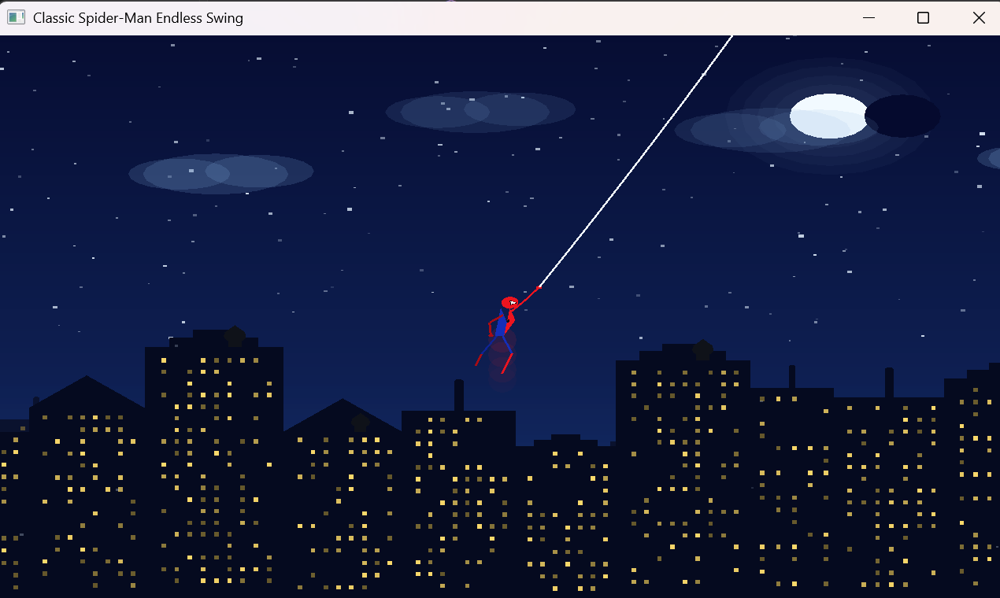

# Projects

This folder contains various computer graphics and Python projects completed during the semester.

---

## Spider-Man Animation

**File:** `projects/spider-man.py`

### Overview
A Python script using OpenGL to render a Spider-Man character animation. The project demonstrates character rendering, animation loops, and interactive graphics using OpenGL.

### Features
- Spider-Man character design using OpenGL primitives
- Animation loop for continuous rendering
- 2D graphics rendering pipeline
- Keyboard/mouse interaction support

### Visual Result


*The image shows the Spider-Man character rendered with OpenGL, demonstrating character animation and rendering techniques.*

### How to Run

```bash
python projects/spider-man.py
```

**Requirements:**
- Python 3.x
- PyOpenGL
- PyGLUT

## License

These projects are for educational purposes, demonstrating computer graphics and animation techniques.